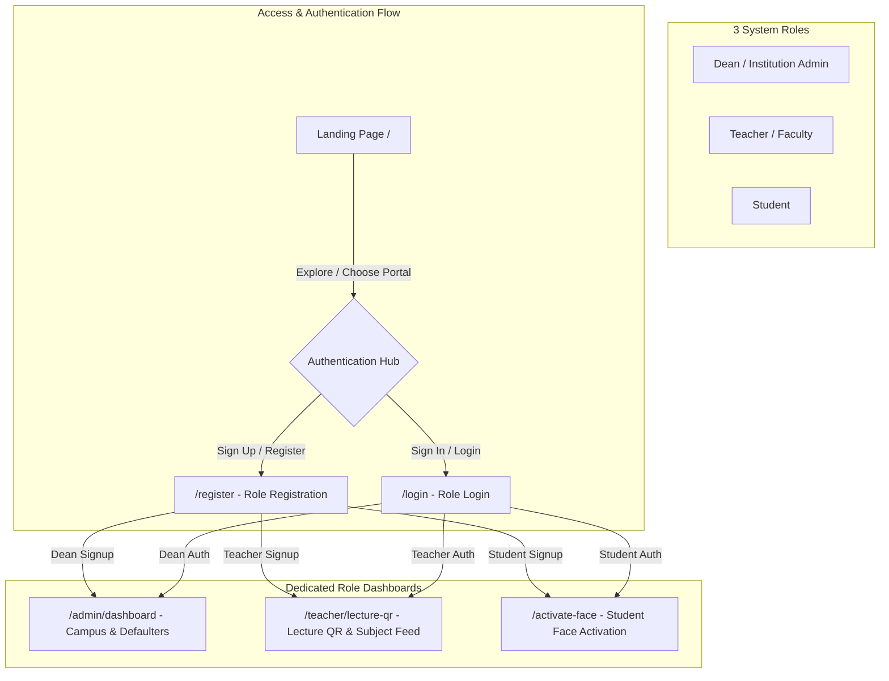

# Attendzo — Attendance System (College & University Focus)

<div align="center">
  <h3>Touchless Attendance, Subject Lecture QR Kiosks & 75% Defaulter Analytics</h3>

  
  
  
  
  

</div>

---

## 📌 Project Overview

**Attendzo** is an attendance system specifically engineered for **Colleges and Universities**.

Traditional educational attendance relies on manual paper roll calls or expensive hardware terminals subject to proxy attendance, administrative delay, and loss of records. Attendzo solves this by providing a streamlined architecture:
1. **CSV Roster Import (`/admin/roster-import`)**: Faculty and admins bulk import class lists (`Roll_Number, Name, Email, Department`).
2. **Student Face Activation (`/activate-face`)**: Students enter their Roll Number, confirm identity, and snap a camera selfie to activate Face ID.
3. **Subject Lecture QR Kiosk (`/teacher/lecture-qr`)**: Teachers project dynamic timed QR codes for specific courses (`CS101 Algorithms`), displayed on classroom screens.
4. **Academic Defaulter Analytics**: Automatic student attendance percentage tracking with real-time alerts for students falling below the mandatory **75% Exam Eligibility Threshold**.

---

## 🌟 Key Features

### 🎓 Student Experience
- **Student Face Activation (`/activate-face`)**: Enter Roll Number → Confirm Name → Snap Selfie.
- **Classroom Kiosk Check-in (`/attend`)**: Touchless check-in via QR Code scan or real-time Face Recognition.
- **Personal Attendance History**: View attendance percentage per subject and track exam eligibility status.

### 👨‍🏫 Teacher / Faculty Portal
- **Subject Lecture QR Generator (`/teacher/lecture-qr`)**: Generate live timed QR codes for specific courses (`CS101`, `EE202`).
- **Live Classroom Stream**: Monitor real-time student check-ins as students scan into the active lecture session.
- **Subject Attendance Register**: View class attendance percentage and flagged defaulters.

### 🛡️ Dean / Admin Dashboard
- **CSV Class Roster Import (`/admin/roster-import`)**: Bulk upload class rosters or seed sample classes.
- **Campus GPS Geofencing**: Configure campus coordinates and geofence radius.
- **Academic Defaulter Reports (<75% Rule)**: Real-time list of students below the mandatory attendance requirement.
- **Export Registers**: Download compiled attendance registers in Excel (`.xlsx`) and CSV formats.

---

## 👥 3-Role Architecture & User Flow



---

## 📂 Project Structure

```
qr-attendance-system/
├── docs/                                # Complete 30-Mark Academic Documentation Suite
│   ├── README.md                        # Master Documentation Index
│   ├── 1_SRS_DOCUMENT.md                # SRS & Educational Architecture
│   ├── 2_DATABASE_AND_SCHEMA.md         # ERD Diagrams & Data Dictionary
│   ├── 3_API_AND_TECHNICAL_MANUAL.md    # REST API Docs & 75% Defaulter Math
│   ├── 4_USER_MANUAL_AND_DEMO_GUIDE.md    # User Manuals & 10-Min Live Demo Script
│   └── 5_TEAM_TASK_BREAKDOWN.md         # 3-Member Group Role & Rubric Matrix
│
├── frontend/                            # Next.js 14 App Router Frontend
│   ├── src/
│   │   ├── app/
│   │   │   ├── page.jsx                 # Landing Page
│   │   │   ├── register/page.jsx        # Registration Portal
│   │   │   ├── activate-face/page.jsx   # Student Face Activation
│   │   │   ├── attend/page.jsx          # Classroom Attendance Kiosk
│   │   │   ├── teacher/lecture-qr/      # Subject Lecture QR Generator
│   │   │   ├── admin/roster-import/     # CSV Class Roster Import Engine
│   │   │   └── admin/dashboard/         # Academic Analytics & Defaulters
│   │   ├── components/
│   │   │   ├── QRScanner.jsx            # Kiosk Verification Component
│   │   │   ├── FaceScanner.jsx          # face-api.js ML Biometric Scanner
│   │   │   └── shared/Logo.jsx          # Attendzo Transparent Logo Component
│   │   └── public/
│   │       ├── logo.png                 # Primary Attendzo Transparent Logo
│   │       └── logo_transparent.png     # Transparent PNG Asset
│   └── package.json
│
└── backend/                             # Node.js / Express REST API Backend
    ├── controllers/
    │   ├── auth.controller.js           # Auth & Institution Onboarding
    │   ├── attendance.controller.js     # Kiosk Attendance & Haversine GPS
    │   └── admin.controller.js          # Academic Reports & Defaulter Engine
    ├── models/
    │   ├── Employee.js                  # Student / Teacher Schema
    │   ├── Attendance.js                # Attendance Log Schema
    │   └── SystemSetting.js             # Campus Geofence Settings Schema
    └── package.json
```

---

## 📄 Complete Project Documentation (`docs/`)

The repository includes a complete academic documentation package prepared for evaluation:

- 📄 **[`docs/1_SRS_DOCUMENT.md`](file:///e:/Projects/qr-attendance-system/docs/1_SRS_DOCUMENT.md)** — SRS Document & Architecture.
- 📄 **[`docs/2_DATABASE_AND_SCHEMA.md`](file:///e:/Projects/qr-attendance-system/docs/2_DATABASE_AND_SCHEMA.md)** — ERD & Data Dictionary.
- 📄 **[`docs/3_API_AND_TECHNICAL_MANUAL.md`](file:///e:/Projects/qr-attendance-system/docs/3_API_AND_TECHNICAL_MANUAL.md)** — REST API & 75% Defaulter Math.
- 📄 **[`docs/4_USER_MANUAL_AND_DEMO_GUIDE.md`](file:///e:/Projects/qr-attendance-system/docs/4_USER_MANUAL_AND_DEMO_GUIDE.md)** — User Manuals & 10-Min Presentation Playbook.
- 📄 **[`docs/5_TEAM_TASK_BREAKDOWN.md`](file:///e:/Projects/qr-attendance-system/docs/5_TEAM_TASK_BREAKDOWN.md)** — 3-Member Group Task & Marks Matrix (Muhammad Ashraf, Shehzad Nisar, Muhammad Umer Kamran).

---

## 🚀 Getting Started

### Prerequisites
- Node.js 18+
- MongoDB 6+ (Local or MongoDB Atlas)
- npm 9+

### 1. Clone the repository
```bash
git clone https://github.com/muhammadashrafz23/qr-attendance-system.git
cd qr-attendance-system
```

### 2. Backend Setup
```bash
cd backend
npm install
npm start
```

### 3. Frontend Setup
```bash
cd ../frontend
npm install
npm run dev
```

Open [http://localhost:3000](http://localhost:3000) in your browser to view the **Attendzo SaaS Platform**.

---

© 2026 Attendzo — Academic Attendance SaaS Platform.
