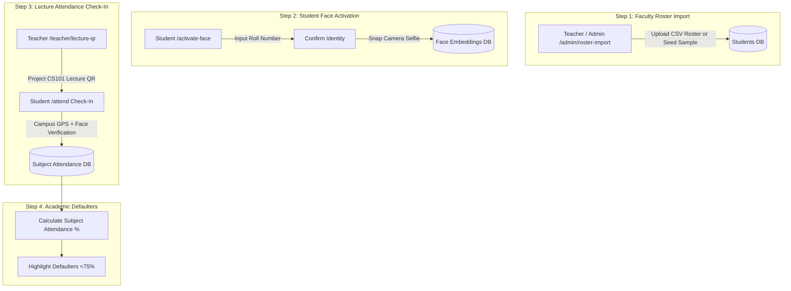

# Software Requirement Specification (SRS) & SaaS Architecture
## Project: Attendzo — College & University SaaS Platform (Approach 2)

---

## 1. Executive Summary

**Attendzo** is a specialized **Educational Attendance SaaS Platform** engineered for Colleges and Universities.

Attendzo implements **Approach 2 (CSV Class Roster Import + 1-Click Student Face Activation)**:
- **Faculty / Admin CSV Class Roster Import (`/admin/roster-import`)**: Teachers and administrators upload CSV roster files or click "Quick Import Sample Class" to seed student profiles automatically.
- **1-Click Student Face Activation (`/activate-face`)**: Zero long forms for students! Students enter their Roll Number / ID, confirm identity, and snap a 3-second camera selfie to activate Face ID.
- **Subject Lecture QR Generator (`/teacher/lecture-qr`)**: Teachers project dynamic timed QR codes for specific courses (`CS101 Algorithms`), displayed on classroom screens.
- **Academic Defaulter Analytics**: Automatic student attendance percentage tracking with real-time alerts for students falling below the mandatory **75% Exam Eligibility Threshold**.

---

## 2. Educational Architecture & Flow

---

## 3. Functional Requirements

- **FR-1**: CSV Class Roster Import (`/admin/roster-import`) supporting bulk student profile generation.
- **FR-2**: 1-Click Student Face Activation Portal (`/activate-face`) requiring only Roll Number lookup and 3-second camera selfie.
- **FR-3**: Teacher Subject Lecture QR Code Generator (`/teacher/lecture-qr`) with countdown session timer and real-time attendance feed.
- **FR-4**: Touchless Student Kiosk (`/attend`) validating campus GPS coordinates via Haversine formula.
- **FR-5**: Academic Defaulter Analytics computing subject-wise attendance percentages and flagging students `< 75%`.
