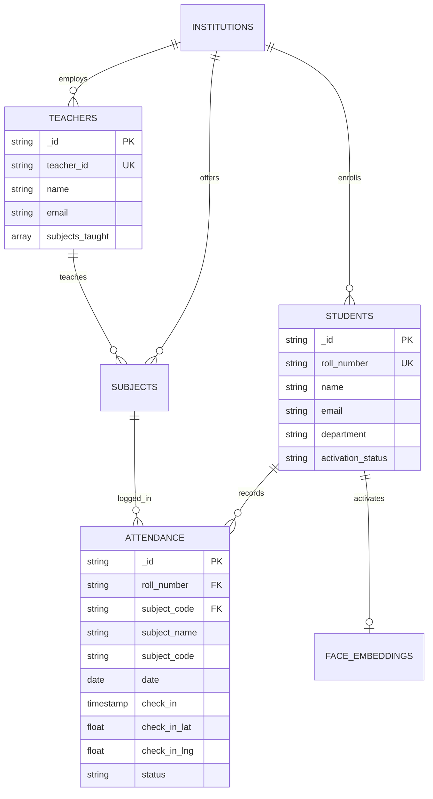

# Database & Schema Documentation
## Project: Attendzo — Educational SaaS Platform
## Project: Attendzo — College & University SaaS Platform

---

## 1. Entity-Relationship Diagram (ERD)

---

## 2. Detailed Data Dictionary
## 2. Approach 2 Data Dictionary

### `attendance` Collection / Table (Option B: Subject-Wise)
### `students` Collection / Table

| Field Name | Type | Constraints | Description |
|---|---|---|---|
| `_id` | ObjectId / String | Primary Key | Attendance record identifier |
| `roll_number` | String | Required, FK | Student Roll Number / ID |
| `subject_code` | String | Required | Subject / Course code (e.g. `CS101`) |
| `subject_name` | String | Required | Full course name (e.g. `Algorithms & Data Structures`) |
| `date` | Date String | `YYYY-MM-DD` | Calendar date of lecture |
| `check_in` | Timestamp | Required | Exact check-in timestamp |
| `status` | Enum | `present`, `late`, `absent` | Attendance status |

> [!IMPORTANT]
> **Unique Constraint**: `UNIQUE (roll_number, subject_code, date)` guarantees one attendance entry per student per subject lecture session per day.
| `_id` | ObjectId / String | Primary Key | Record identifier |
| `roll_number` | String | Unique per Institution | Student Roll Number / College ID (e.g. `CS-2026-001`) |
| `name` | String | Required | Full student name imported from CSV |
| `email` | String | Unique | Student institutional email |
| `department` | String | Required | Academic department (e.g. `Computer Science`) |
| `activation_status` | Enum | `pending_face`, `activated` | 1-Click Face Activation status |
